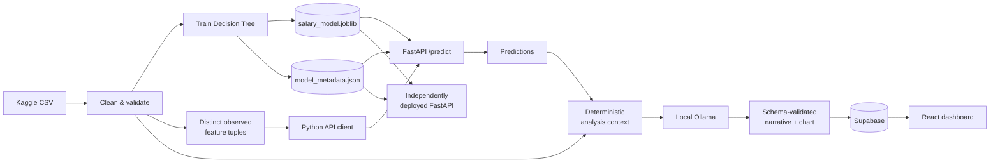

# Salary Prediction Application

End-to-end ML salary prediction system for data-science jobs: a scikit-learn Decision Tree model served over FastAPI, a local-Ollama analysis pipeline, Supabase persistence, and a React + Vite + TypeScript dashboard.

**Live API**: [salary-prediction-api-65r0.onrender.com](https://salary-prediction-api-65r0.onrender.com) (`/health`, `/model/info`, `/predict` — free tier, may take 30–60s to wake up if idle). Frontend not yet deployed.

## Architecture



**The React dashboard reads only from Supabase.** It never calls Ollama, the local generation pipeline, or the FastAPI prediction endpoint at runtime — predictions and narratives are generated once, validated, and published; the dashboard just displays what's already there. This keeps the dashboard fast and available even when the local pipeline isn't running, and keeps the independently-deployed FastAPI service usable on its own for direct API evaluation.

## Tech stack

| Layer | Stack |
|---|---|
| ML | Python, pandas, scikit-learn (`DecisionTreeRegressor` in a `Pipeline`), joblib |
| API | FastAPI, Pydantic, Uvicorn |
| Pipeline | httpx (API client), Ollama REST API, `supabase-py` |
| Persistence | Supabase (Postgres + RLS + PostgREST) |
| Frontend | React 19, Vite, TypeScript, TanStack Query, React Router, Zod, Recharts |
| Testing | pytest, Vitest + React Testing Library |

## Dataset

[Kaggle: Data Science Job Salaries](https://www.kaggle.com/datasets/ruchi798/data-science-job-salaries) (`ruchi798/data-science-job-salaries`), 607 raw rows, 2020–2022. See `docs/data_inspection.md` and `docs/feature_decision_record.md` for the full inspection and the target/leakage/duplicate/outlier decisions made from it.

## Repository structure

```text
frontend/   React + Vite + TypeScript dashboard
backend/    FastAPI prediction service (independently deployable, Dockerfile included)
ml/         Data cleaning, feature engineering, Decision Tree training, evaluation
scripts/    Local generation pipeline: input-space coverage, API client, Ollama analysis, Supabase persistence
supabase/   Migrations (pipeline_runs, salary_results, RLS policies)
docs/       Generated reports (dataset inspection, cleaning, model choice) + hand-authored decision records
```

## Local setup

### Prerequisites

- Python 3.11+ (developed against 3.14)
- Node.js 20+
- [Ollama](https://ollama.com) running locally with a pulled model (`ollama pull llama3.2`)
- A [Supabase](https://supabase.com) project and the [Supabase CLI](https://supabase.com/docs/guides/cli) (`brew install supabase/tap/supabase`)

### 1. Python environment

```bash
python3 -m venv .venv
source .venv/bin/activate
pip install -r requirements-dev.txt
```

### 2. Environment variables

```bash
cp .env.example .env
```

Fill in `SUPABASE_URL` and `SUPABASE_SERVICE_ROLE_KEY` (Project Settings → API in the Supabase dashboard, or `supabase projects api-keys --project-ref <ref>`), and the matching `VITE_SUPABASE_URL` / `VITE_SUPABASE_ANON_KEY` for the frontend. The service-role key must never be prefixed `VITE_` — the frontend only ever uses the anon key, and RLS (see `supabase/migrations/`) is what actually restricts it to reading published data.

### 3. Supabase schema

```bash
supabase login --token <your-personal-access-token>   # supabase.com/dashboard/account/tokens
supabase init                                           # if supabase/config.toml doesn't already exist
supabase link --project-ref <your-project-ref>
supabase db push                                        # applies supabase/migrations/
```

### 4. Data → model

```bash
python -m ml.src.data.inspect     # profiles the raw CSV -> docs/data_inspection.md
python -m ml.src.data.clean       # -> ml/data/processed/salaries_clean.csv
python -m ml.src.training.train   # -> ml/artifacts/model/{salary_model.joblib,model_metadata.json}
```

### 5. Run the API locally

```bash
uvicorn backend.app.main:app --reload --port 8000
```

Try it: `curl "http://127.0.0.1:8000/predict?experience_level=SE&employment_type=FT&job_title=Data%20Scientist&employee_residence=US&company_location=US&company_size=M&work_year=2022&remote_ratio=100"`

### 6. Run the generation pipeline

Requires the API (step 5) and Ollama both running:

```bash
python -m scripts.run_pipeline
```

This predicts every distinct observed feature combination in the cleaned dataset, generates LLM narratives for a fixed reproducible sample (see `scripts/run_pipeline.py`'s module docstring for why), and publishes the run to Supabase if enough predictions succeeded.

### 7. Frontend

```bash
cd frontend
npm install
npm run dev
```

## Commands

```bash
# Python tests + linting
source .venv/bin/activate
pytest
ruff check .

# Frontend
cd frontend
npm run build   # tsc -b && vite build
npm test        # vitest run
npm run lint    # oxlint
```

## Model

`DecisionTreeRegressor` inside one scikit-learn `Pipeline` with preprocessing, so the model and its feature transforms can never drift apart. Hyperparameters (`max_depth`, `min_samples_split`, `min_samples_leaf`) are chosen via 5-fold cross-validation on the training split only; the held-out test set is touched exactly once, for final evaluation.

Current metrics (see `ml/artifacts/model/model_metadata.json` for the live values): **MAE ≈ $34,500, RMSE ≈ $48,100, R² ≈ 0.49** on the held-out test set. R² in this range is expected for this dataset at this size — individual compensation has real unexplained variance that job title/experience/location/company size alone don't fully capture.

## Deployment

The FastAPI service and the React dashboard deploy independently.

**FastAPI — live at [salary-prediction-api-65r0.onrender.com](https://salary-prediction-api-65r0.onrender.com)** (Render, free tier — the first request after idling can take 30–60s to wake the instance). Deployed from `backend/Dockerfile` via `render.yaml` (Render Blueprint), building from the repo root:

```bash
docker build -f backend/Dockerfile -t salary-prediction-api .
docker run -p 8000:8000 salary-prediction-api
```

`/health`, `/model/info`, and `/predict` work standalone with no environment variables. `/narrate` additionally needs `ml/data/processed/salaries_clean.csv` and a reachable Ollama instance — neither is available on this free-tier deployment (Ollama only runs on a local machine), so `/narrate` there correctly returns `503 NARRATOR_UNAVAILABLE` rather than crashing; it works when run locally per the setup above. Set `CORS_ALLOWED_ORIGINS` to your deployed frontend's origin once the dashboard is deployed and expected to call this directly.

**React** (`frontend/`): a standard Vite build (`npm run build` → `frontend/dist/`), deployable to any static host (Vercel, Netlify, Cloudflare Pages). Set `VITE_SUPABASE_URL` and `VITE_SUPABASE_ANON_KEY` as the host's environment variables — never the service-role key. Set `VITE_API_BASE_URL` to the Render URL above if you want the `/predict` page's prediction (not narrative — see above) to work from the deployed frontend. Not yet deployed — pending your go-ahead on a static host.

## Limitations

- Predictions are estimates from historical, self-reported salary data — not compensation guarantees.
- The dataset shows associations between job attributes and salary, not causal relationships.
- Some rare job-title/location combinations exist only in the held-out test split, so the API correctly rejects them as unsupported rather than serving a degraded prediction (see `docs/data_inspection.md`'s cardinality notes).
- LLM narratives are generated for a fixed, reproducible sample of predictions, not all of them — a local ~3B model takes 10–25s per generation, which doesn't scale to hundreds of calls in an interactive run. Every distinct observed input still gets a direct model prediction.
- A local 3B model can occasionally state a schema-valid but logically inconsistent comparison (e.g. get the "above/below median" direction wrong even while citing the correct numbers) — see `docs/ollama_model_choice.md`.
