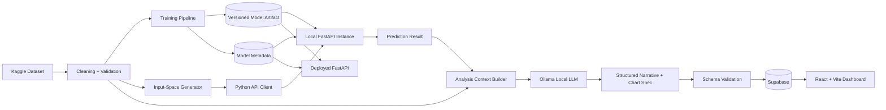

# Salary Prediction Application - Architecture

## 1. Architectural Style

The project uses a **pre-generation architecture** with two deliberately separate concerns:

1. **Local generation pipeline** - prepares data, trains/loads the model, obtains predictions, runs local LLM analysis, and persists completed results.
2. **Deployed consumption layer** - the React application reads already-generated results from Supabase.

A **standalone deployed FastAPI service** is also required. It exposes the same trained model independently for direct prediction API evaluation, but it is not a runtime dependency of the React dashboard.

---

## 2. System Context



Important boundary:

```text
React dashboard -> Supabase only
React dashboard -X-> Ollama
React dashboard -X-> local generation pipeline
React dashboard -X-> FastAPI prediction endpoint for normal dashboard rendering
```

---

## 3. Major Components

### 3.1 Data ingestion and cleaning

Responsibilities:

- Load the raw CSV.
- Validate schema.
- Produce a cleaning report.
- Handle missing values explicitly.
- Remove duplicates or document retention.
- Detect target leakage.
- Produce deterministic processed data.

Output:

- `data/processed/salaries_clean.csv`
- `artifacts/data_profile.json`
- `artifacts/cleaning_report.json`

### 3.2 Training pipeline

Recommended stack:

- Python 3.11+
- pandas
- scikit-learn
- joblib

Use a single scikit-learn `Pipeline` containing both preprocessing and `DecisionTreeRegressor`.

Recommended structure:

```text
ColumnTransformer
├── categorical -> OneHotEncoder(handle_unknown="ignore")
└── numeric     -> passthrough or explicit numeric transformer

DecisionTreeRegressor
```

The serialized object should contain preprocessing + model together so API prediction cannot accidentally use different preprocessing logic.

### 3.3 Model artifact and metadata

Save:

```text
artifacts/model/salary_model.joblib
artifacts/model/model_metadata.json
```

Metadata should include:

```json
{
  "model_name": "decision_tree_salary_regressor",
  "model_version": "2026-09-19.1",
  "target": "salary_in_usd",
  "feature_columns": [],
  "categorical_domains": {},
  "numeric_ranges": {},
  "metrics": {
    "mae": 0,
    "rmse": 0,
    "r2": 0
  },
  "dataset_hash": "...",
  "trained_at": "ISO-8601"
}
```

### 3.4 FastAPI prediction service

Responsibilities:

- Load model once during application startup.
- Validate query parameters.
- Translate request values into one model input row.
- Return prediction + model version.
- Return deterministic API errors.
- Expose model metadata.

Endpoints:

```text
GET /health
GET /api/v1/metadata
GET /api/v1/predict
```

The assignment requires GET for predictions, so use query parameters rather than replacing it with POST.

### 3.5 Input-space generator

Purpose: cover meaningful prediction inputs without a combinatorial explosion.

Default algorithm:

```python
features = cleaned_df[MODEL_FEATURES]
observed_inputs = features.drop_duplicates().sort_values(MODEL_FEATURES)
```

This creates one API request for every distinct observed feature tuple.

If this remains too large:

1. Keep all low-cardinality combinations.
2. Stratify on high-cardinality columns such as job title or location.
3. Use a fixed random seed.
4. Verify that every category value appears at least once in the selected set.
5. Write a coverage report.

### 3.6 Python API client

Responsibilities:

- Convert generated inputs to query parameters.
- Call FastAPI.
- Apply a connect/read timeout.
- Retry transient connection errors and 5xx responses with bounded backoff.
- Do not retry deterministic 4xx validation failures.
- Validate the response schema.
- Accumulate successes and failures.

Recommended libraries:

- `httpx`
- `pydantic`
- standard `logging`

### 3.7 Analysis context builder

The LLM should not inspect raw data and invent its own calculations.

Build deterministic statistics in Python first, for example:

```json
{
  "prediction": 128500,
  "comparison_group": {
    "description": "Senior Data Scientists at medium companies",
    "sample_size": 42,
    "mean_salary_usd": 124800,
    "median_salary_usd": 121000,
    "p25_salary_usd": 101000,
    "p75_salary_usd": 148000
  },
  "chart_data": [
    {"label": "Entry", "value": 76000},
    {"label": "Mid", "value": 103000},
    {"label": "Senior", "value": 129000}
  ]
}
```

Then ask the LLM to explain those supplied facts.

### 3.8 Ollama analysis service

Ollama remains local to the generation environment.

Configuration:

```text
OLLAMA_BASE_URL=http://localhost:11434
OLLAMA_MODEL=<configurable local model>
```

Use structured output. Validate the final object with Pydantic before persistence.

Example response contract:

```json
{
  "headline": "Senior remote roles sit above the selected peer median",
  "summary": "...",
  "key_insights": ["...", "..."],
  "chart": {
    "type": "bar",
    "title": "Median salary by experience level",
    "x_key": "label",
    "y_key": "value",
    "data": [
      {"label": "Entry", "value": 76000},
      {"label": "Senior", "value": 129000}
    ]
  },
  "limitations": ["Observed dataset associations are not causal."]
}
```

Never execute code returned by the LLM.

### 3.9 Supabase persistence

Supabase is the system of record for dashboard-ready generated results.

Recommended schema:

#### `pipeline_runs`

| Column | Type | Notes |
|---|---|---|
| `id` | uuid PK | generated UUID |
| `status` | text | `building`, `published`, `failed` |
| `model_version` | text | required |
| `dataset_hash` | text | required |
| `llm_model` | text | required |
| `prompt_version` | text | required |
| `model_metrics` | jsonb | MAE/RMSE/R² |
| `coverage_summary` | jsonb | attempted/success/failed/category coverage |
| `created_at` | timestamptz | required |
| `published_at` | timestamptz nullable | only set after success |

#### `salary_results`

| Column | Type | Notes |
|---|---|---|
| `id` | uuid PK | generated UUID |
| `run_id` | uuid FK | references `pipeline_runs` |
| `feature_signature` | text | deterministic hash, unique per run |
| `work_year` | int nullable | if included as a model feature |
| `experience_level` | text | indexed |
| `employment_type` | text | indexed |
| `job_title` | text | indexed |
| `employee_residence` | text nullable | indexed if used |
| `remote_ratio` | int nullable | indexed if used |
| `company_location` | text nullable | indexed if used |
| `company_size` | text | indexed |
| `features` | jsonb | full model input for extensibility |
| `predicted_salary_usd` | numeric | required |
| `analysis_headline` | text | required for completed record |
| `analysis_summary` | text | required for completed record |
| `key_insights` | jsonb | array |
| `chart_spec` | jsonb | validated chart object |
| `analysis_context` | jsonb | computed statistics supplied to LLM |
| `limitations` | jsonb | array |
| `created_at` | timestamptz | required |

Constraints:

- Unique: `(run_id, feature_signature)`.
- Check: `predicted_salary_usd >= 0`.
- Check: `remote_ratio` is one of expected supported values when that feature exists.

### 3.10 React dashboard

Recommended stack:

- React
- Vite
- TypeScript
- React Router
- TanStack Query
- Supabase JS
- Recharts
- Tailwind CSS or a small token-based CSS layer
- Zod for runtime validation of Supabase-derived JSON fields such as `chart_spec`

Responsibilities:

- Discover the latest `published` run.
- Query only records for that run.
- Filter and paginate results.
- Render summary metrics and charts.
- Show narrative and limitations.
- Handle missing/partial data gracefully.

---

## 4. Repository Structure

Use one repository with clear application boundaries:

```text
salary-prediction-app/
├── apps/
│   ├── api/
│   │   ├── app/
│   │   │   ├── api/
│   │   │   │   ├── routes/
│   │   │   │   └── dependencies.py
│   │   │   ├── core/
│   │   │   │   ├── config.py
│   │   │   │   ├── errors.py
│   │   │   │   └── logging.py
│   │   │   ├── models/
│   │   │   │   └── schemas.py
│   │   │   ├── services/
│   │   │   │   └── predictor.py
│   │   │   └── main.py
│   │   ├── tests/
│   │   ├── requirements.txt
│   │   └── Dockerfile
│   │
│   └── web/
│       ├── src/
│       │   ├── app/
│       │   ├── components/
│       │   ├── features/
│       │   │   ├── dashboard/
│       │   │   ├── results/
│       │   │   └── methodology/
│       │   ├── lib/
│       │   │   ├── supabase.ts
│       │   │   ├── queries.ts
│       │   │   └── schemas.ts
│       │   ├── routes/
│       │   ├── styles/
│       │   └── main.tsx
│       ├── tests/
│       ├── package.json
│       └── vite.config.ts
│
├── ml/
│   ├── src/
│   │   ├── data/
│   │   │   ├── clean.py
│   │   │   └── validate.py
│   │   ├── features/
│   │   │   └── build_features.py
│   │   ├── training/
│   │   │   ├── train.py
│   │   │   └── evaluate.py
│   │   └── common/
│   └── tests/
│
├── pipeline/
│   ├── generate_inputs.py
│   ├── api_client.py
│   ├── build_context.py
│   ├── llm_client.py
│   ├── validate_analysis.py
│   ├── persist.py
│   └── run_pipeline.py
│
├── data/
│   ├── raw/
│   └── processed/
├── artifacts/
│   ├── model/
│   └── reports/
├── supabase/
│   └── migrations/
├── docs/
│   ├── prd.md
│   ├── architecture.md
│   ├── essentials.md
│   ├── plan.md
│   ├── security.md
│   └── design.md
├── scripts/
├── .env.example
├── .gitignore
└── README.md
```

Do not create duplicated preprocessing implementations across `ml/`, `pipeline/`, and `apps/api/`.

---

## 5. Data Flow

### Training flow

```text
raw CSV
  -> schema checks
  -> cleaning
  -> processed CSV
  -> train/test split
  -> preprocessing + DecisionTreeRegressor
  -> evaluation
  -> model.joblib + model_metadata.json
```

### Pre-generation flow

```text
processed data
  -> distinct observed feature tuples
  -> Python API client
  -> local FastAPI
  -> salary predictions
  -> deterministic comparison statistics
  -> Ollama
  -> validate structured analysis
  -> Supabase building run
  -> verify completeness
  -> mark run published
```

### Dashboard flow

```text
browser
  -> React
  -> Supabase public/anon read access under RLS
  -> latest published run + salary_results
  -> cards + filters + table + charts + narrative
```

### Independent API deployment

```text
external caller
  -> deployed FastAPI
  -> versioned model artifact
  -> validated JSON response
```

---

## 6. API Contract

### `GET /health`

Response:

```json
{
  "status": "ok",
  "model_loaded": true,
  "model_version": "2026-09-19.1"
}
```

### `GET /api/v1/metadata`

Returns:

- model version
- required features
- allowed categorical values
- numeric bounds
- target name
- metrics safe to expose

### `GET /api/v1/predict`

Query parameters are derived from `model_metadata.json`.

Response:

```json
{
  "prediction": {
    "salary_usd": 128500.0,
    "currency": "USD"
  },
  "model": {
    "name": "decision_tree_salary_regressor",
    "version": "2026-09-19.1"
  },
  "input": {}
}
```

Errors use a stable shape:

```json
{
  "error": {
    "code": "INVALID_INPUT",
    "message": "Unsupported experience_level",
    "details": {}
  }
}
```

---

## 7. Supabase Read Pattern

The frontend should first request the latest published run:

```text
pipeline_runs
filter: status = 'published'
order: published_at desc
limit: 1
```

Then all dashboard queries include that `run_id`.

This prevents the frontend from mixing records from different model versions or incomplete pipeline runs.

---

## 8. Publication Transaction Strategy

Do not expose partial runs as current data.

1. Insert `pipeline_runs` row with `status='building'`.
2. Generate and persist results under that run ID.
3. Verify expected/attempted/succeeded counts.
4. If acceptance threshold is met, update run to `published` and set `published_at`.
5. If unrecoverable failure occurs, set `status='failed'`.

The React dashboard queries published runs only.

---

## 9. Logging and Observability

Use structured logs where practical.

Every pipeline log should include:

- `run_id`
- `stage`
- `model_version`
- event/message
- duration where relevant
- error class for failures

Never log secret keys or full environment dumps.

---

## 10. Testing Architecture

### ML tests

- Dataset schema validation.
- Deterministic cleaning.
- No target leakage.
- Model artifact can be serialized and loaded.
- Prediction output is finite and non-negative.

### API tests

- Health route.
- Valid prediction.
- Missing required parameter.
- Unsupported category.
- Invalid numeric value.
- Model load failure handling.

### Pipeline tests

- API timeout.
- 422 response.
- 500 response.
- Invalid JSON response.
- Invalid LLM JSON.
- Supabase insert failure.
- Publication only after completion.

### Frontend tests

- Published run loading.
- Empty state.
- Error state.
- Filtering.
- Chart-spec validation.
- Result detail rendering.

---

## 11. Deployment Architecture

Recommended deployment:

```text
React/Vite -> Vercel or equivalent static/frontend host
FastAPI    -> Railway / Render / equivalent Python container host
Supabase   -> managed Supabase project
Ollama     -> local development/generation machine only
```

Ollama does not need to be deployed for the live dashboard because analysis is pre-generated.

---

## 12. Architectural Invariants

The agent must not violate these without explicitly documenting a change:

1. Production model is a Decision Tree regressor.
2. API prediction is GET-based.
3. Inputs are validated.
4. Preprocessing and model stay synchronized.
5. Ollama is local for analysis generation.
6. Dashboard data is persisted before display.
7. React dashboard reads from Supabase rather than generating analysis live.
8. Deployed FastAPI is an independent deliverable.
9. Partial pipeline runs are not published.
10. LLM output is treated as untrusted structured data and validated before persistence/rendering.
