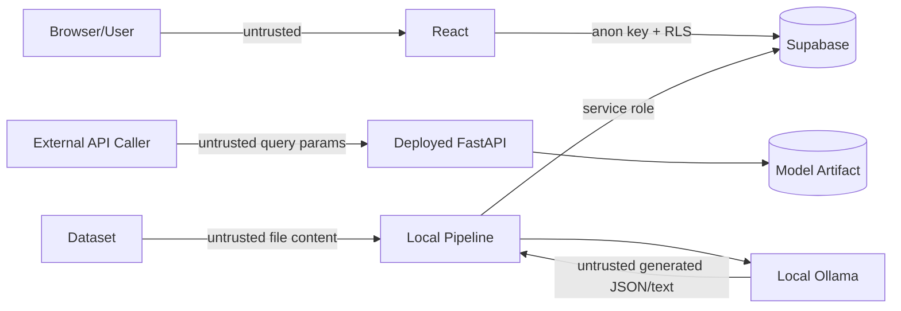

# Salary Prediction Application - Security

## 1. Security Objectives

This project does not process highly sensitive personal data, but it still has several meaningful attack surfaces:

- Public FastAPI endpoint.
- Public React application.
- Supabase database and API keys.
- Local Ollama service.
- Untrusted dataset contents.
- Untrusted LLM output.
- Dependency and deployment supply chain.

Security goals:

1. Prevent exposure of privileged credentials.
2. Prevent unauthorized database writes from the browser.
3. Validate all external inputs.
4. Treat model and LLM outputs as untrusted data before rendering/persistence.
5. Avoid code execution from LLM output.
6. Prevent partial pipeline runs from being presented as valid published results.
7. Avoid information leakage through errors or logs.

---

## 2. Trust Boundaries



Privileged boundary:

- `SUPABASE_SERVICE_ROLE_KEY` is allowed only in trusted local/backend pipeline code.
- It must never be bundled into React.

---

## 3. Secret Management

### Allowed client-side variables

```text
VITE_SUPABASE_URL
VITE_SUPABASE_ANON_KEY
```

The Supabase anon key is designed to be public when RLS is correctly configured.

### Server/pipeline-only variables

```text
SUPABASE_SERVICE_ROLE_KEY
```

Rules:

- Keep real `.env` files out of Git.
- Commit `.env.example` only.
- Configure deployment secrets in the hosting platform.
- Never print all environment variables to logs.
- Never use service-role credentials in frontend code.
- Rotate leaked credentials immediately.

Recommended `.gitignore` entries:

```gitignore
.env
.env.*
!.env.example
*.joblib
__pycache__/
.venv/
node_modules/
dist/
```

Whether model artifacts are committed is a project decision. If excluded, document how deployment obtains the exact versioned model.

---

## 4. Supabase Security

Enable Row Level Security on dashboard-facing tables.

### Principle

Browser users should have:

- SELECT access to published dashboard data.
- No INSERT access.
- No UPDATE access.
- No DELETE access.

Pipeline code uses the service role for writes.

### Recommended policy model

`pipeline_runs` public SELECT policy:

```sql
using (status = 'published')
```

For `salary_results`, either:

1. Store an `is_published` boolean synchronized during publication and allow SELECT only where true, or
2. Use an RLS policy that verifies the referenced run is published.

Prefer the simpler approach that is easiest to verify correctly.

### Required controls

- RLS enabled on both tables.
- No public write policies.
- Foreign keys enabled.
- Unique constraint on `(run_id, feature_signature)`.
- Check constraints for important numeric invariants.
- Use migrations; do not rely only on manual dashboard changes.

---

## 5. FastAPI Input Security

Treat all query parameters as untrusted.

Requirements:

- Use explicit Pydantic/FastAPI types.
- Apply max lengths to string fields.
- Validate category membership.
- Validate numeric bounds.
- Reject unexpected/unsupported values.
- Avoid dynamically evaluating any input.
- Never interpolate user input into shell commands.
- Avoid raw SQL entirely for prediction routes.

Error handling:

- Return generic internal errors for unexpected exceptions.
- Log technical detail server-side.
- Never expose full stack traces in production responses.

---

## 6. API Abuse Controls

The prediction endpoint is inexpensive but public deployments can still be abused.

Production recommendations:

- Restrict CORS to known frontend/origin needs rather than `*` when browser access is required.
- Set request timeouts at the hosting/reverse-proxy layer.
- Add basic rate limiting if the platform supports it or if abuse is observed.
- Limit request/query length.
- Expose only required endpoints.
- Disable debug mode in production.

Do not add complex authentication unless required by the assignment or deployment environment.

---

## 7. Dataset Safety

Even a CSV should be treated as untrusted input.

- Validate expected file extension and schema.
- Validate row/column counts within reasonable bounds.
- Coerce numerics safely.
- Reject malformed required columns.
- Do not execute formulas or macros.
- Do not use `eval()` on cell content.
- Keep the raw file immutable.

If exporting CSV for human download later, protect against spreadsheet formula injection for cells beginning with `=`, `+`, `-`, or `@`.

---

## 8. Model Artifact Safety

`joblib`/pickle-style artifacts can execute code during deserialization.

Therefore:

- Load only model artifacts produced by this trusted project pipeline.
- Do not accept model uploads from users.
- Do not download arbitrary `.joblib` files at runtime.
- Prefer checksums/versioned artifacts in deployment.
- Record the dataset hash and model version in metadata.

---

## 9. Ollama / LLM Security

### Data privacy

Use local Ollama so analysis context does not need to be sent to an external LLM provider.

### Output trust

LLM output is untrusted.

Required controls:

- Ask for strict structured JSON.
- Validate output with Pydantic.
- Reject unknown chart types.
- Enforce maximum lengths for narrative fields.
- Enforce maximum number of insights/data points.
- Never execute code generated by the model.
- Never let the model choose SQL to execute.
- Never let the model provide arbitrary HTML to render.

### Prompt grounding

The system prompt should require:

- Use only supplied numeric facts.
- Do not invent percentages/statistics.
- Distinguish association from causation.
- State uncertainty/limitations when sample sizes are small.

The application should compute chart data in Python where possible. The LLM may select presentation and wording, not fabricate the numbers.

---

## 10. Frontend Rendering Security

React escapes text by default. Preserve that protection.

Rules:

- Do not use `dangerouslySetInnerHTML` for LLM narratives.
- Render narrative as plain text/controlled Markdown only if a safe Markdown renderer is deliberately configured.
- Validate `chart_spec` with Zod before passing values to chart components.
- Map chart types through an allowlist rather than dynamic component names from arbitrary input.
- Do not evaluate JavaScript embedded in stored data.

---

## 11. CORS

Development may permit:

```text
http://localhost:5173
```

Production should explicitly allow only required origins if browser clients directly call FastAPI.

Because the React dashboard's main data path is Supabase, FastAPI CORS can be very restrictive unless an API demo page requires it.

---

## 12. Logging Security

Log:

- Request ID/run ID.
- Endpoint/stage.
- Validation category.
- Duration.
- HTTP status.

Do not log:

- Service-role keys.
- Full `.env` contents.
- Authorization headers.
- Entire exception objects if they embed secrets.

The dataset contains job salary observations rather than application user credentials, but avoid unnecessary replication of raw rows in logs.

---

## 13. Dependency Security

- Pin direct dependency versions.
- Commit lockfiles.
- Run `npm audit` and a Python dependency audit tool when practical.
- Remove unused packages.
- Avoid random code copied from unknown sources.
- Review dependency licenses if required for deployment.

Suggested checks:

```bash
npm audit
pip-audit
```

These tools are advisory; investigate results rather than applying unsafe automated upgrades blindly.

---

## 14. Deployment Security Checklist

### React

- [ ] Only anon Supabase key is present in bundled environment variables.
- [ ] No service-role key is present.
- [ ] Production source maps handled intentionally.
- [ ] HTTPS provided by hosting platform.
- [ ] Error UI does not reveal secrets.

### Supabase

- [ ] RLS enabled.
- [ ] Public role can only read published data.
- [ ] Public role cannot write.
- [ ] Migrations are version controlled.

### FastAPI

- [ ] Debug disabled.
- [ ] Model artifact is trusted/versioned.
- [ ] Inputs validated.
- [ ] Stack traces hidden from clients.
- [ ] HTTPS available through hosting platform.
- [ ] Health endpoint does not expose secrets or file paths.

### Local pipeline

- [ ] Service-role key stays local/secret.
- [ ] Ollama binds locally unless intentionally exposed.
- [ ] Failed LLM JSON is rejected.
- [ ] Failed/incomplete run is never published.

---

## 15. Security Acceptance Criteria

- [ ] No privileged key exists in browser code or built assets.
- [ ] RLS prevents anonymous writes.
- [ ] API rejects invalid category values.
- [ ] API rejects out-of-range numeric values.
- [ ] Unexpected API exceptions do not return stack traces.
- [ ] Model artifacts are loaded only from trusted project paths.
- [ ] LLM output is schema validated.
- [ ] LLM output cannot execute code or raw HTML.
- [ ] Pipeline publication is atomic from the dashboard's perspective.
- [ ] Secrets are not committed to Git.
